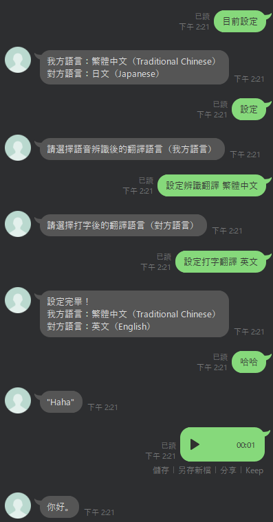

# gpt-ai-translator

使用 Flask、OpenAI whisper API、GPT3.5 API 來開發語言翻譯 Line 機器人。  
Using Flask, OpenAI whisper API, GPT3.5 API to develop line language translator.

## 使用案例



#### 使用指令

| 指令     | 別名             | 說明         |
| -------- | ---------------- | ------------ |
| 目前設定 | /current-setting | 查詢目前設定 |
| 設定     | /setting         | 設定語言     |

**備註：建議在手持裝置操作這些指令，因為輸入"設定"會一步步帶各位完成語言設定哦。**

#### 支援語系

| 語系     | 英文描述            |
| -------- | ------------------- |
| 繁體中文 | Traditional Chinese |
| 英文     | English             |
| 日文     | Japanese            |
| 韓文     | Korean              |
| 法文     | French              |
| 泰文     | Thai                |
| 義大利文 | Italian             |
| 西班牙文 | Spanish             |
| 荷蘭文   | Dutch               |
| 德文     | German              |

## 如何開始

#### 環境變數

- [ ] ENVIRONMENT
- [x] LINE BOT ACCESS TOKEN
- [x] LINE BOT SECRET
- [x] OPENAI API KEYS

[x] 代表必填。

#### 部署至 Vercel

[](https://vercel.com/new/clone?repository-url=https%3A%2F%2Fgithub.com%2Fcdcd72%2Fgpt-ai-translator&env=ENVIRONMENT,LINE_CHANNEL_ACCESS_TOKEN,LINE_CHANNEL_SECRET,OPENAI_API_KEY)

## 如何偵錯

#### 調整 api/index.py 部分程式碼以可以在本機測試

```python
# from api.ai.chatgpt import ChatGPT
# from api.config.configs import *
from ai.chatgpt import ChatGPT
from config.configs import *
```

#### 依據 .env.example 格式並在根目錄新增 .env

    ENVIRONMENT=DEVELOPMENT
    LINE_CHANNEL_ACCESS_TOKEN=your_line_channel_access_token
    LINE_CHANNEL_SECRET=your_line_channel_secret
    OPENAI_API_KEY=your_openai_api_key

#### 安裝相依套件

    pip install -r requirements.txt

#### 執行 Flask

    py api/index.py

## 參考

- Line SDK : [https://github.com/line/line-bot-sdk-python](https://github.com/line/line-bot-sdk-python)
- OpenAI API Document : [https://platform.openai.com/docs/introduction](https://platform.openai.com/docs/introduction)
